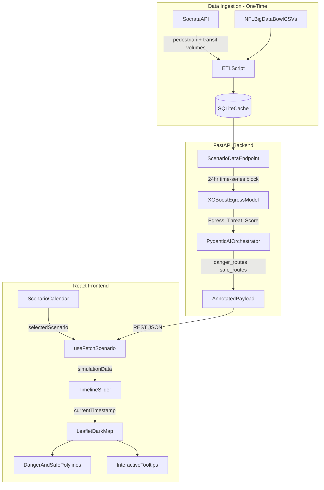

# SafeTransit: AI-Driven Urban Mobility -- Execution Plan

## Goal

Build an interactive 2D tactical map for the "Best AI for Human Safety" hackathon track. The system models mass egress events to prevent crowd crushes at Seattle's Lumen Field across a "3-Day Stress Test" of high-attendance game scenarios. All data is pre-cached for zero-latency demo performance.

## Architecture



## Project Structure (Greenfield Repo)

```
safetransit/
  backend/
    app/
      main.py                    # FastAPI entry, CORS, lifespan
      config.py                  # Settings: OPENAI_API_KEY, DB path, Socrata keys
      etl/
        seattle_data.py          # Socrata API ingestion for pedestrian/transit data
        nfl_data.py              # NFL Big Data Bowl CSV loader + correlation
        scenarios.py             # 3 pre-configured game-day scenario definitions
      ml/
        features.py              # Feature engineering: score diff, momentum, time pressure
        train.py                 # Offline XGBoost training script
        predictor.py             # Runtime inference: Egress_Threat_Score, Estimated_Crowd_Volume
      ai/
        schemas.py               # Pydantic models: EgressPrediction, RoutingPayload
        orchestrator.py          # Pydantic AI Agent (OpenAI) for routing decisions
      api/
        routes.py                # GET /scenario/{id}, GET /scenario/{id}/timeseries
      db/
        models.py                # SQLAlchemy ORM: transit_cache, predictions, routing_decisions
        session.py               # Async SQLite session factory
    data/
      nfl/                       # User places NFL Big Data Bowl CSVs here
      geojson/                   # Safe/danger route GeoJSON arrays
    requirements.txt
  frontend/
    src/
      components/
        ScenarioCalendar.jsx     # 3-day game selector cards
        TimelineSlider.jsx       # 24-hour HTML range slider (00:00-23:59)
        SeattleMap.jsx           # react-leaflet dark-mode map with dynamic overlays
        AlertPanel.jsx           # AI safety alerts and rerouting messages
        Dashboard.jsx            # Main layout composing all components
      hooks/
        useFetchScenario.js      # Fetches 24hr data block on scenario selection
      App.jsx
      main.jsx
    package.json
    vite.config.js
    tailwind.config.js
  README.md
```

## Phase 1: Data Ingestion and Backend API

### 1a. Seattle Open Data ETL (`etl/seattle_data.py`)

- Use the **Socrata Open Data API** (`sodapy` client) to pull historical pedestrian counts and transit ridership volumes from `data.seattle.gov` for the 3 selected game days.
- Endpoints of interest:
  - Pedestrian counts: `data.seattle.gov/resource/2bpn-c4xm.json` (or equivalent active dataset)
  - Transit ridership: corresponding Sound Transit or King County Metro datasets available on the portal
- Cache all pulled data into SQLite via SQLAlchemy so the demo has **zero network dependency** at runtime.
- Each cached record: `(scenario_id, timestamp_minute, location_id, pedestrian_volume, transit_load)`.

### 1b. NFL Data Loader (`etl/nfl_data.py`)

- Load user's NFL Big Data Bowl CSVs (`games.csv`, `plays.csv`, `tracking_gameId_*.csv`).
- Select 3 games that represent the stress-test profiles:
  - **Scenario A** (Group Stage): Normal post-game exit pattern
  - **Scenario B** (Quarter-Final): High-attendance, close game, standard egress
  - **Scenario C** (Blowout): 3rd-quarter blowout triggers premature mass exodus
- For each scenario, build a minute-by-minute timeline correlating: play events, score differential, quarter, game clock, and derived momentum metrics.

### 1c. Scenario API (`api/routes.py`)

- `GET /api/scenarios` -- returns list of 3 available scenarios with metadata (date, teams, attendance, profile type)
- `GET /api/scenarios/{scenario_id}/timeseries` -- returns the full 24-hour annotated time-series block:

```python
{
  "scenario_id": "blowout_q3",
  "metadata": {"date": "2026-06-20", "teams": "USA vs Mexico", "attendance": 68000},
  "timeline": [
    {
      "minute": 0,
      "transit_load": {"stadium_station": 120, "king_street": 450},
      "pedestrian_volume": {"1st_ave": 200, "occidental_ave": 80},
      "game_state": None,
      "egress_threat_score": 0.0,
      "estimated_crowd_volume": 0,
      "danger_routes": None,
      "safe_routes": None
    },
    {
      "minute": 1125,
      "transit_load": {"stadium_station": 1850},
      "game_state": {"quarter": 3, "clock": "8:22", "home": 14, "away": 35, "play": "INT returned for TD"},
      "egress_threat_score": 0.89,
      "estimated_crowd_volume": 22000,
      "danger_routes": [{"path": [[47.5914, -122.3316]], "label": "Stadium Station overflow"}],
      "safe_routes": [{"path": [[47.5914, -122.3316]], "label": "Reroute via King Street Station"}]
    }
  ]
}
```

This payload is **pre-computed** at startup (or via an offline script) and served from cache. The frontend never waits on ML inference.

## Phase 2: ML and AI Integration

### 2a. Feature Engineering (`ml/features.py`)

Per-minute features derived from the NFL play data:

- **Score differential**: `home_score - away_score`
- **Time pressure**: minutes remaining in game, weighted by quarter (Q4 minutes count 2x)
- **Momentum index**: exponentially weighted moving average of `PlayResult` over last 5 plays
- **Scoring velocity**: points scored in last 5 minutes by each team
- **Blowout indicator**: binary flag when score differential exceeds 14 in Q3+

### 2b. XGBoost Egress Model (`ml/train.py`)

- **Output**: Two values per game-minute: `Egress_Threat_Score` (0.0-1.0 continuous) and `Estimated_Crowd_Volume` (integer, 0 to stadium capacity)
- **Training data**: Historical play-by-play from NFL Big Data Bowl, with synthetic egress labels derived from game-state heuristics (blowout rules, final-whistle patterns, weather)
- **Model**: XGBoost regressor, trained offline, saved as `.joblib` -- loads at FastAPI startup

### 2c. Pydantic AI Routing Orchestrator (`ai/orchestrator.py`)

Invoked during the pre-computation step for each minute where `Egress_Threat_Score > 0.5`:

```python
from pydantic import BaseModel, Field
from pydantic_ai import Agent, RunContext
from dataclasses import dataclass

class RoutingPayload(BaseModel):
    danger_routes: list[dict] = Field(description="GeoJSON-style paths of overwhelmed corridors")
    safe_routes: list[dict] = Field(description="GeoJSON-style paths for recommended rerouting")
    alert_message: str = Field(description="Human-readable safety alert for dispatchers")
    severity: int = Field(description="1-5 threat severity", ge=1, le=5)

@dataclass
class EgressContext:
    egress_threat_score: float
    estimated_crowd_volume: int
    game_state: dict
    transit_loads: dict
    available_routes: list[dict]  # pre-traced GeoJSON from geojson.io

routing_agent = Agent(
    'openai:gpt-4o',
    deps_type=EgressContext,
    output_type=RoutingPayload,
    instructions=(
        "You are a crowd safety AI for Seattle transit. Given game state, "
        "egress predictions, and current transit loads, select which corridors "
        "are dangerous and recommend safe rerouting paths from the available options. "
        "Prioritize human safety above all else."
    ),
)
```

The agent selects from the **pre-traced GeoJSON routes** (provided by the business/product team via `geojson.io`) rather than inventing coordinates, ensuring geographical accuracy.

## Phase 3: Interactive 2D Frontend

### 3a. Tech Stack

- **Vite + React 18** for fast builds
- **Tailwind CSS** with a dark theme (slate/navy palette, emerald green accents for safe routes, red for danger)
- **react-leaflet** for the 2D map (NOT React Three Fiber -- this plan uses 2D Leaflet)

### 3b. Scenario Calendar (`ScenarioCalendar.jsx`)

- Three clickable cards, each representing one stress-test day
- Each card shows: date, matchup, expected attendance, scenario profile tag (e.g., "Blowout", "Sold Out", "Close Game")
- Selecting a card sets `selectedScenario` state and fetches the 24-hour data block from the API

### 3c. 24-Hour Timeline Slider (`TimelineSlider.jsx`)

- HTML `<input type="range">` styled with Tailwind, spanning minutes 0-1439 (00:00-23:59)
- Displays formatted time label (e.g., "18:45")
- Color-coded track segments: gray for normal, yellow for elevated, red for high-threat periods
- Scrubbing updates `currentTimestamp` in global state, which drives all map overlays

### 3d. Seattle Map (`SeattleMap.jsx`)

- **react-leaflet** `<MapContainer>` centered on Lumen Field (`[47.5952, -122.3316]`), zoom level ~14
- Dark-mode tile layer (CartoDB Dark Matter: `https://{s}.basemaps.cartocdn.com/dark_all/{z}/{x}/{y}{r}.png`)
- **Transit node markers**: Circle markers at known transit stops (Stadium Station, King Street, SODO, etc.) with radius proportional to current load
- **Dynamic overlays** driven by `currentTimestamp`:
  - `<Polyline>` components for `danger_routes` (red, dashed, animated)
  - `<Polyline>` components for `safe_routes` (emerald green, solid, glowing)
  - `<Popup>` tooltips on stressed intersections showing: threat score, crowd estimate, AI recommendation
- When slider is in a non-threat window, overlays are hidden; they appear as soon as the slider enters a flagged danger timestamp

### 3e. Alert Panel (`AlertPanel.jsx`)

- Sidebar or bottom drawer showing the AI's `alert_message` for the current timestamp
- Severity badge (1-5 scale, color-coded)
- Historical log of all alerts for the selected scenario, scrollable

### 3f. State Architecture

```
selectedScenario  -->  useFetchScenario()  -->  simulationData (full 24hr block)
currentTimestamp  -->  derived current frame from simulationData.timeline[minute]
                  -->  drives: map overlays, alert panel, transit node sizes
```

All data is fetched once per scenario selection. The slider operates entirely client-side on the cached data -- no API calls during scrubbing.

## Phase 4: Persistence and Demo Polish

### 4a. SQLAlchemy + SQLite (`db/`)

Three tables:

- `transit_cache`: Cached Socrata API data (scenario_id, minute, location_id, volumes)
- `predictions`: ML outputs per minute (scenario_id, minute, egress_threat_score, crowd_volume)
- `routing_decisions`: Pydantic AI outputs (scenario_id, minute, danger_routes JSON, safe_routes JSON, alert_message, severity)

### 4b. GeoJSON Route Preparation

- Use `geojson.io` to manually trace 4-6 key pedestrian corridors around Lumen Field:
  - Lumen Field main exits to Stadium Station (1st Ave S)
  - Lumen Field to King Street Station (S King St)
  - Lumen Field to SODO Station (1st Ave S southbound)
  - Occidental Ave pedestrian corridor
  - Edgar Martinez Dr to Pioneer Square
- Store as JSON arrays in `backend/data/geojson/routes.json`
- These are the "available_routes" the Pydantic AI agent selects from

### 4c. 3-Day Stress Test Demo Narrative

1. **Scenario A (Group Stage)**: Normal game. Slider shows gradual pre-game buildup, steady state during game, orderly post-game egress. No danger flags. Demonstrates the baseline.
2. **Scenario B (Quarter-Final)**: Sold-out high-attendance game. Post-game egress is intense but predictable. AI flags Stadium Station at 95% capacity 8 minutes before final whistle. Safe routes highlight King Street and SODO alternatives.
3. **Scenario C (Blowout)**: Home team down 35-14 in Q3. Pick-six triggers `Egress_Threat_Score` of 0.89. AI predicts 22,000 fans leaving 15 minutes early. Map lights up red on Stadium Station corridor, green safe routes to King Street. This is the "money shot" for the judges.

## Key Dependencies

**Backend** (`requirements.txt`):

- `fastapi`, `uvicorn[standard]`
- `pandas`, `numpy`
- `xgboost`, `scikit-learn`, `joblib`
- `pydantic-ai[openai]`
- `sqlalchemy[asyncio]`, `aiosqlite`
- `sodapy` (Socrata Open Data API client)
- `httpx`

**Frontend** (`package.json`):

- `react`, `react-dom`
- `react-leaflet`, `leaflet`
- `tailwindcss`, `@tailwindcss/vite`

## Environment Variables

- `OPENAI_API_KEY`: Required for Pydantic AI orchestrator
- `SOCRATA_APP_TOKEN`: Optional but recommended for Seattle Open Data API rate limits
- `NFL_DATA_DIR`: Path to NFL Big Data Bowl CSV directory
- `DATABASE_URL`: SQLite path (default: `sqlite+aiosqlite:///./safetransit.db`)

## Acceptance Criteria

- Selecting any of the 3 scenarios loads the full 24-hour data block in under 1 second from cache.
- Scrubbing the timeline slider renders map overlays in real-time with no perceptible lag.
- Blowout scenario (C) clearly demonstrates the AI predicting early mass egress and drawing safe rerouting paths.
- All ML predictions and AI routing decisions are persisted and queryable in SQLite.
- The entire demo runs offline after initial ETL -- no external API calls during presentation.
